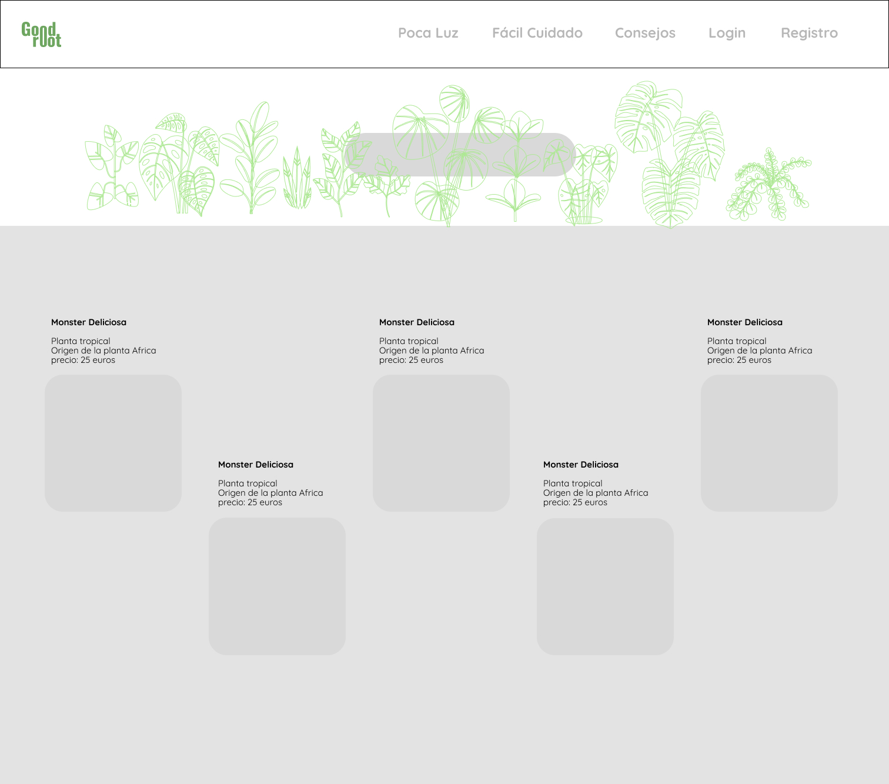

# Tema: Consumo de una API

Este proyecto se basa en coger datos de una api externa y de un json creado, esta aplicación solo muestra como se puede obtener datos a traves del fetch y una funcion asíncrona.

## Api 
La OpenWeatherMap API es una interfaz de programación de aplicaciones que proporciona datos meteorológicos. Permite acceder a información meteorológica actual y pronósticos para integrarla en sus aplicaciones, sitios web u otros servicios.

Para utilizar la OpenWeatherMap API, hacer los sigiuentes pasos:
- Regístrate: Crea una cuenta en el sitio web de OpenWeatherMap y obtén tu clave de API. La clave es necesaria para autenticar tus solicitudes a la API.
- Selecciona el Tipo de Plan: OpenWeatherMap ofrece varios planes, incluyendo un plan gratuito con ciertas limitaciones y planes de pago con características adicionales. Selecciona el plan que se ajuste a tus necesidades.
- Realiza Solicitudes a la API: Utiliza tu clave de API para realizar solicitudes HTTP a las endpoints de la OpenWeatherMap API. Las solicitudes pueden ser para obtener datos actuales, pronósticos, mapas meteorológicos y más.

Aquí hay un ejemplo simple de cómo obtener el pronóstico actual del clima para una ubicación específica utilizando la API de OpenWeatherMap con JavaScript y Fetch:

Funcion asíncrona
```javascript
async function checkWeather(city) {
        const response = await fetch(apiUrl + city + `&appid=${apiKey}`);
        let data = await response.json();
        console.log(data);
}
```
Esto es un ejemplo de como obtener los datos del json creado.
```javascript
fetch('plants.json')
    .then(res => res.json())
    .then(datosRecibidosJson => {allPlants = datosRecibidosJson.plants;
        // Imprimir todas las plantas
        printPlants(allPlants);
       
    })
    .catch(error => console.error("Error al obtener datos del servidor:", error));
```
### Imagénes
 Las imágenes son utilizadas de pinterest

### Trello
https://trello.com/invite/b/KXC7sAEF/ATTI49dc06d38aa35926ae1b901943a24803012CBC65/plantas

### Figma
 

### Tecnologías utilizadas:
<p align="left"> 
</a> <a href="https://getbootstrap.com" target="_blank" rel="noreferrer"> 
 </a> <a href="https://www.figma.com/" target="_blank" rel="noreferrer"> 
</a> <a href="https://git-scm.com/" target="_blank" rel="noreferrer">  </a> 
<a href="https://www.w3.org/html/" target="_blank" rel="noreferrer">  </a> 
<a href="https://www.adobe.com/in/products/illustrator.html" target="_blank" rel="noreferrer">  </a> 
<a href="https://developer.mozilla.org/en-US/docs/Web/JavaScript" target="_blank" rel="noreferrer"> 
  </a>


